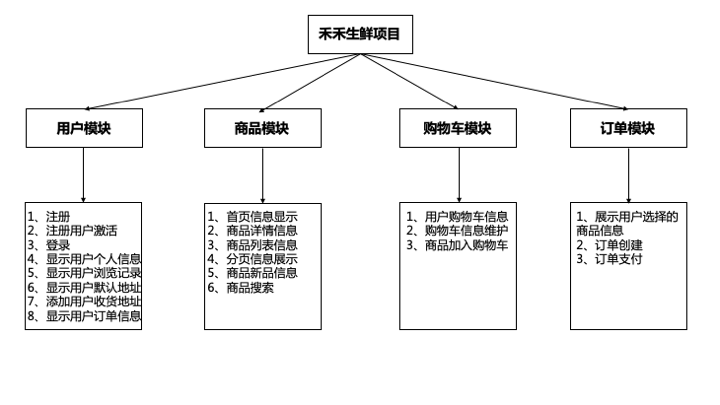
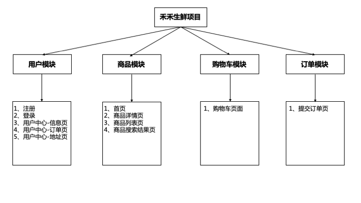

# 禾禾生鲜在线商城

禾禾生鲜是一个提供在线生鲜类商品购买的 B2B2C 购物平台，他为用户提供了在线生鲜产品的了解和购买服务，用户可以通过本平台实现浏览商品、添加购物车、商品结算等功能。本项目采用 Django 进行开发，平台由用户、商品、购物车、订单等模块组成。

主要功能模块如下：

## 页面介绍

整体页面设计如下：

### 用户模块

- 注册页
    - 注册时校验用户名是否已被注册。
    - 完成用户信息的注册。
    - 给用户的注册邮箱发送邮件，用户点击邮件中的激活链接完成用户账户的激活。
- 登录页
    - 实现用户的登录功能。
- 用户中心
    - 用户中心信息页：显示登录用户的信息，包括用户名、电话和地址，同时页面下方显示出用户最近浏览的商品信息。
    - 用户中心地址页：显示登录用户的默认收件地址，页面下方的表单可以新增用户的收货地址。
    - 用户中心订单页：显示登录用户的订单信息。
- 其他
    - 如果用户已经登录，页面顶部显示登录用户的信息。

### 商品模块

- 首页
    - 动态指定首页轮播商品信息。
    - 动态指定首页活动信息。
    - 动态获取商品的种类信息并显示。
    - 动态指定首页显示的每个种类的商品(包括图片商品和文字商品)。
    - 点击某一个商品时跳转到商品的详情页面。
- 商品详情页
    - 显示出某个商品的详情信息。
    - 页面的左下方显示出该种类商品的2个新品信息。
- 商品列表页
    - 显示出某一个种类商品的列表数据，分页显示并支持按照默认、价格、和人气进行排序。
    - 页面的左下方显示出该种类商品的2个新品信息。
- 其他
    - 通过页面搜索框搜索商品信息。

### 购物车模块

- 列表页和详情页将商品添加到购物车。
- 用户登录后，首页，详情页，列表页显示登录用户购物车中商品的数目。
- 购物车页面：对用户购物车中商品的操作。如选择某件商品，增加或减少购物车中商品的数目。

### 订单模块

- 提交订单页面：显示用户准备购买的商品信息。
- 点击提交订单完成订单的创建。
- 用户中心订单页显示用户的订单信息。
- 点击支付完成订单的支付。
